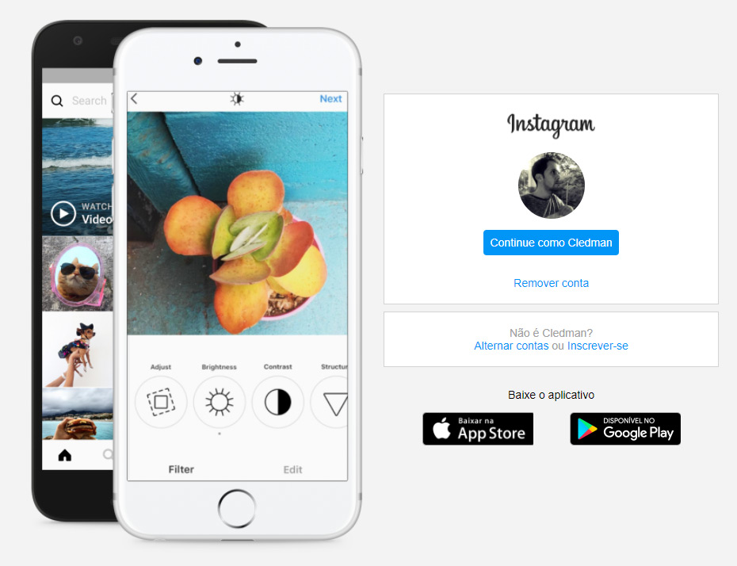
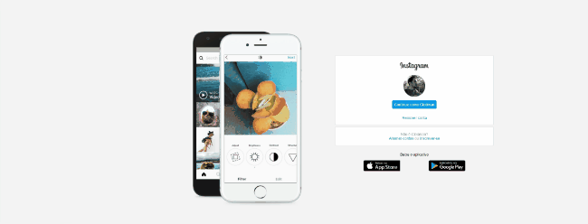

<p align="center">
   
</p>

# Flexbox Study

This project is part from the course "Recreating Instagram home page" from [Digital Innovation One](https://web.digitalinnovation.one/) using Flexbox layout.


<p align="center">
    
</p>

---

# Guide

* [Features](#features)
* [Installation](#installation)
* [Using](#using)
* [Technologies](#technologies)
* [Future Implementations](#future-implementations)


# Features

*  Responsible layout using flexbox.


# Installation

```git clone https://github.com/cledman/flexboxstudy```


# Using

```Run the index.html file```

# Technologies

* [HTML](https://www.w3schools.com/html/) to write the page, 
* [CSS](https://www.w3schools.com/css/) to handle the styles, layout and rendering, 


# Future Implementations

* We could make slidshow fotos on the cell picute as on the Instagram real page.


Thanks to:
* [Gabriela Pinheiro](https://www.linkedin.com/in/gabrielapinheiro129/) 
##